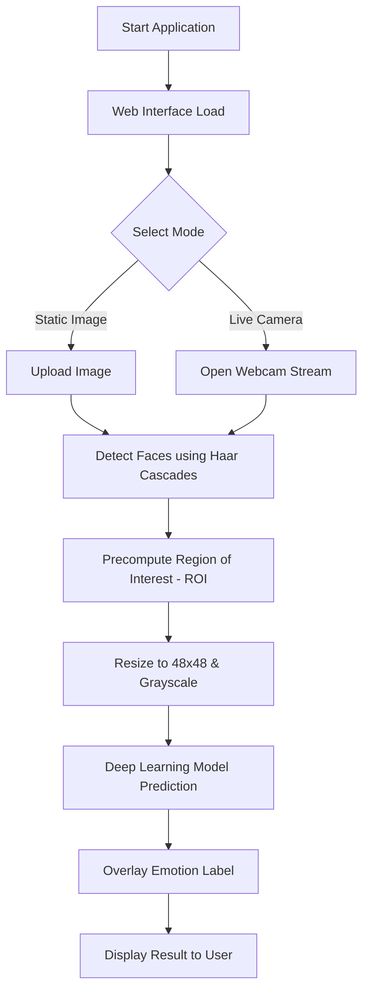

# 🎭 Face Emotion Recognition with Deep Learning

   

A robust, real-time Facial Emotion Recognition (FER) system built using Convolutional Neural Networks (CNN) and deployed as a web application using Flask.

---

## 🚀 Key Features

- **Real-time Detection**: Seamlessly detect emotions through your webcam.
- **Image Analysis**: Upload and analyze facial expressions in static images.
- **High Accuracy**: Powered by a deep learning model trained on the FER2013 dataset.
- **Interactive UI**: User-friendly web interface with live feedback.
- **Visual Feedback**: Real-time bounding boxes and emotion labels with confidence percentages.

---

## 🔄 Project Flow & Logic

The project follows a modular architecture, separating the core AI logic from the web interface.

### 1. Data Processing
The model expects a 48x48 pixel grayscale image. The input is normalized (divided by 255.0) before being fed into the CNN.

### 2. Model Architecture
- **Input Layer**: Grayscale frames (48x48x1).
- **CNN Layers**: Extract spatial features like eye position, mouth shape, and brow furrows.
- **Output Layer**: Softmax activation predicting 7 emotions: `Angry`, `Disgust`, `Fear`, `Happy`, `Sad`, `Surprise`, `Neutral`.

### 3. Execution Logic


---

## 📂 Project Structure

- `app.py`: The heart of the web server (Flask).
- `FER_Camera.py`: Handles the video stream and real-time inference logic.
- `Live_FER.py`: Utility script for running detection on local files or testing.
- `model.json`: The saved architecture of our Neural Network.
- `model_weights.h5`: The "brain" of the project containing pre-trained weights.
- `templates/`: HTML files for the front-end.
- `static/`: CSS and Images used in the UI.

---

## 🛠️ Installation & Setup

1. **Clone the repository**:
   ```bash
   git clone https://github.com/blackArcher33/Face_Emotions_Recogination.git
   cd Face_Emotions_Recogination
   ```

2. **Install dependencies**:
   ```bash
   pip install flask opencv-python tensorflow numpy
   ```

3. **Run the application**:
   ```bash
   python app.py
   ```
   Open `http://127.0.0.1:5000` in your browser.

---

## 🖼️ Preview


> **Pro Tip**: Ensure your face is well-lit for the best real-time accuracy!

---

## 👨‍💻 Author
**Udit Singh**
[GitHub Profile](https://github.com/blackArcher33)

---
*Developed for research and educational purposes.*
